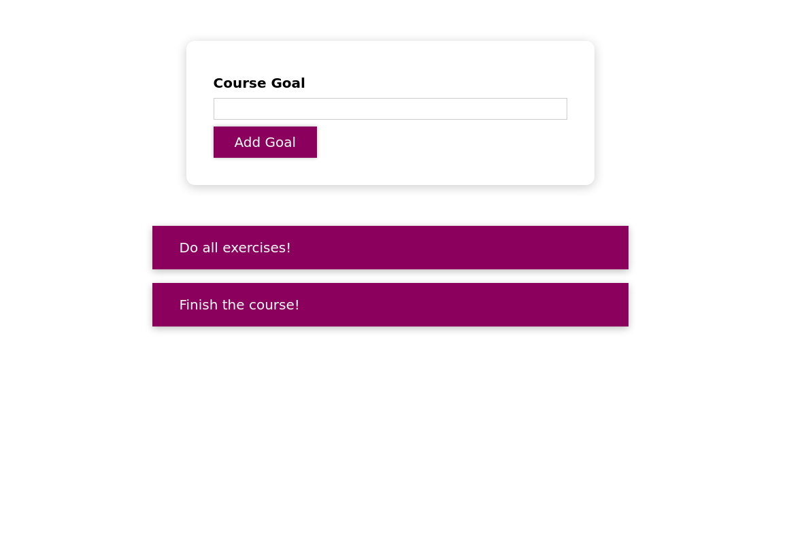
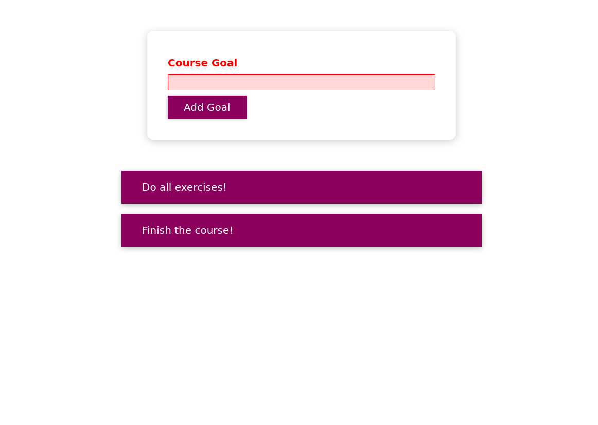

#  React Components Styling

This simple application is made in ReactJs for styling using different styling techniques.

In this application, the following techniques for styling react components are used

- conditional and dynamic styling
- scoped styling
- styled-components (a third-party library)
- react in build "Css modules"

### Screen shots

